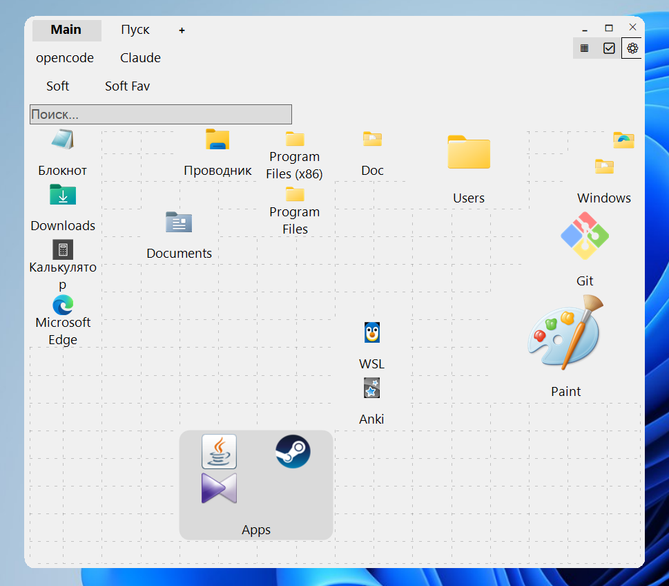

# Tilettes

[English](https://github.com/AlexNoVibe/Tilettes/blob/master/README.md) · [Русский](https://github.com/AlexNoVibe/Tilettes/blob/master/docs/README.ru.md) · [Español](https://github.com/AlexNoVibe/Tilettes/blob/master/docs/README.es.md) · [Português](https://github.com/AlexNoVibe/Tilettes/blob/master/docs/README.pt.md) · [Deutsch](https://github.com/AlexNoVibe/Tilettes/blob/master/docs/README.de.md) · [Français](https://github.com/AlexNoVibe/Tilettes/blob/master/docs/README.fr.md) · [Italiano](https://github.com/AlexNoVibe/Tilettes/blob/master/docs/README.it.md) · [Polski](https://github.com/AlexNoVibe/Tilettes/blob/master/docs/README.pl.md) · **中文 (简体)** · [日本語](https://github.com/AlexNoVibe/Tilettes/blob/master/docs/README.ja.md)

<!-- 添加新语言：创建 docs/README.<语言代码>.md（翻译内容），添加
     lang_xx.cs（以英文字符串为键的界面文本表，见 loc.cs），然后
     扩展上方的语言行、其他每个 README 文件顶部的语言行以及
     Loc.Languages 数组。GitHub 在仓库主页显示 README.md（英文）；
     其他每种语言都位于 docs/ 中，一个文件加一条链接即可。 -->

适用于 Windows 的快速启动面板：由快捷方式、文件夹和标签页组成的磁贴网格，内置模糊搜索和带嵌入式控制台的迷你资源管理器。单个便携式 EXE，无需安装，基于 .NET Framework 4.8 (WinForms)。



当前版本：**v1.0.2** — 从 [Releases](https://github.com/AlexNoVibe/Tilettes/releases/latest) 下载 · [更新日志](#changelog)。状态：**beta**。

## 亮点

**磁贴与标签页** — 磁贴尺寸 1×1…6×6；皮肤（Mint、Night、Android）以及浅色/深色主题；自定义字体和颜色；数量不限、可拖动的多行标签页，自由/网格布局；文件夹可原位打开或以弹窗打开；网格下方可滚动的附加行；多选编辑模式与拖放；每个磁贴可自定义名称、描述（可搜索）和图标；磁贴上的照片/视频预览。

**搜索** — 对名称、程序元数据（描述 / 产品 / 公司）、完整路径和自定义描述的即时模糊搜索；基于缓存的元数据运行（不扫描磁盘）；错误键盘布局纠正（`знерщи` → `python`）；结果会分成两个区块——上方是历史查询（带真实图标、跨会话记住、获得加权），下方是常规结果；每个来源均可开关。

**轻量** — 仅一个 ~0.5 MB (517 KB) 的便携式 exe，所有数据都存放在它旁边；除 Windows 内置的 .NET Framework 外没有任何依赖；仅占用 ~30 MB 内存；图标从 shell 提取，在每个磁贴的生命周期内只提取一次，存入会自我清理的 `iconcache\`；启动操作绝不会阻塞面板（进程分离启动、网络路径后台处理）；启动时只渲染当前活动标签页。

**迷你资源管理器** — 面包屑导航、文件夹/命令/分组书签、内置 `cmd.exe` 控制台（命令历史、Ctrl+滚轮调整字体）；保存的命令一键即可运行，命令中的 `%1` 会展开为当前浏览的文件夹（`wt -d "%1"`）；按扩展名/掩码设置“打开方式”规则，支持导入/导出。

**系统** — 镜像的开始菜单标签页（包括 UWP/商店应用），按计划同步；全局快捷键、可选的 Win 键捕获、托盘、随 Windows 自启动；原生资源管理器上下文菜单；计划与手动备份，一键还原；界面支持 10 种语言。

**开源** — 完全开源；发布版本由 GitHub Actions 从标签构建并附带 SHA256SUMS.txt；整个应用只有一次网络调用（需主动开启的更新检查）；无任何遥测数据。

## 特性

- **面板** — 磁贴尺寸 1×1…6×6，数量不限的标签页（可拖动、多行排列），文件夹可原位打开或以弹窗打开，支持从资源管理器拖放，自定义网格（列数/行数/透明度），图标缩放。
- **搜索** — 覆盖名称、文件名、程序元数据（FileDescription / ProductName / CompanyName）、完整路径和用户描述；可选择包含镜像的开始菜单标签页；模糊匹配精度可调，并支持错误键盘布局纠正（`руддщ` → `hello`）；结果按匹配质量排序，命中的字符会高亮显示；重复的查询会获得历史加权；输入查询后，结果会分成两个区块——上方是记住的历史查询，下方是常规结果（完全重复的条目会合并）；历史搜索行会显示所记住项目的真实图标。
- **迷你资源管理器** — 面包屑导航、文件夹/命令/分组书签（命令中可包含 `%1`，它会展开为当前浏览的文件夹——例如 `wt -d "%1"` 可直接在该处打开 Windows Terminal），以及内置 `cmd.exe` 控制台，支持命令历史、保存的命令和 Ctrl+滚轮字体缩放。（文件搜索模块自 v0.6.0-beta 起已停用——保留了占位代码，便于日后恢复。）
- **文件类型规则** — 按扩展名/掩码设置图标和“打开方式”关联，支持导入/导出。
- **桌面集成** — 托盘图标、随 Windows 自启动、全局快捷键、可选的 Win 键捕获、原生资源管理器上下文菜单、可通过边缘缩放的无边框窗口。
- **皮肤与附加功能** — 装饰性皮肤（专属配色 + 圆角窗口边框）、按计划重建的镜像开始菜单标签页、完整备份存入 `autoBackup\`、面板搜索历史。
- **首次启动与更新** — 一次性欢迎窗口（绘制的“三种来源 → 磁贴网格”示意图、语言选择、检查更新许可、支持作者链接、示例磁贴），以及通过 GitHub Releases 进行的更新检查——有新版本时显示角落角标。

## 首次启动与更新

- **欢迎窗口**（仅在第一次启动时出现）：致谢、说明可能存在错误和不完善之处的提示（附 [Issues](https://github.com/AlexNoVibe/Tilettes/issues) 链接）、绘制的迷你示意图（文件夹、.exe 和 .lnk 卡片 → 箭头 → 带“+”虚影单元格的磁贴网格）、语言选择（10 个旗帜按钮）、检查更新许可、指向[捐助章节](https://github.com/AlexNoVibe/Tilettes#donate)的**支持作者**链接——以及两个退出按钮：直接**关闭**，或**关闭并创建示例磁贴**（记事本、计算器、资源管理器、画图作为现成磁贴）。随时可在设置中通过“再次显示欢迎窗口”重新打开。
- **检查更新** — 应用每 N 天询问一次公共 GitHub Releases API（默认 3 天；首次检查同样发生在第一次启动 N 天之后，而不是立即进行）。不会向任何地方发送任何数据；如果在设置中关闭了检查，则完全不发起网络请求。当存在更新的版本标签时，设置按钮旁会出现绿色 **⟳ 更新** 角标，点击即可打开 [Releases](https://github.com/AlexNoVibe/Tilettes/releases/latest) 页面。设置中的“立即检查”会无视间隔执行一次手动检查（结果会在消息框中报告）。自动安装目前是占位功能（TODO）。
- **测试钩子** — 以 `WINPANEL_MOCK_UPDATE=0.6` 启动应用，即可渲染出“更新”角标，就像存在新版本一样（不涉及网络）。

## 设置参考

所有设置都在同一个对话框中（⚙ 按钮 / 托盘菜单），并保存在 `settings.ini` 里。

### 启动与窗口

| 设置项 | 范围 | 默认值 | 说明 |
|---|---|---|---|
| 启动尺寸（宽 × 高） | 200–4000 | 900 × 800 | 每次启动时的面板尺寸。会话中调整的尺寸不会保存——只保存位置。 |
| 窗口位置（X, Y） | −4000…4000 | 100, 100 | 启动时的屏幕位置。移动窗口时自动更新。 |
| 显示窗口快捷键 | 预设 + 自定义 | Ctrl+Q | 显示/激活面板的全局快捷键。可选择预设（None、Ctrl+Q、Ctrl+Shift+Q、Alt+Q、Ctrl+J 等），或直接在可编辑框中输入任意 `修饰键+按键` 组合（Ctrl/Alt/Shift/Win + 字母或数字）；无法解析的输入会被拒绝并给出说明。 |
| 语言 | en, ru, es, pt, de, fr, it, pl, zh, ja | ru | 界面语言（10 种），立即生效。 |

### 网格与磁贴

| 设置项 | 范围 | 默认值 | 说明 |
|---|---|---|---|
| 网格透明度 | 0–255 | 50 | 网格线的 Alpha 透明度。0 = 不可见。仅在网格开关（▦）打开时绘制。 |
| 网格列数 | 1–100 | 16 | 水平单元格数。磁贴位置会吸附到该网格。 |
| 网格行数 | 1–100 | 16 | 垂直单元格数。 |
| 默认项目尺寸 | 1–6 | 2 | 新添加磁贴的尺寸（1×1 … 6×6 单元格）。 |
| 图标缩放（%） | 25–400 | 100 | 磁贴内图标的大小，为默认值的百分比。 |
| 允许添加图标 | 开/关 | 开 | 编辑模式：拖动磁贴、创建文件夹、接收拖放的文件。关闭后，点击磁贴只会直接启动。 |
| 磁贴标签：两行 | 开/关 | 开 | 高磁贴会把标签折行成两行显示（两行的对齐方式——左/居中/右——可在其旁边的选项中设置）。 |
| 隐藏快捷方式后缀 | 开/关 | 开 | 仅影响显示：标签上会隐藏 “ - Shortcut” / “ — ярлык”（多种语言中的短横线变体）；存储的名称和搜索不受影响——取消勾选即可恢复。 |
| 隐藏文件扩展名 | 开/关 | 开 | 仅影响显示：项目路径的真实扩展名（.mp4 等）不会显示在标签上；取消勾选即可恢复。 |
| 皮肤与主题 | 无（深色）/ 浅色 / 皮肤 | Mint | 经典深色或浅色主题，或带专属配色与窗口边框的装饰性皮肤：Android、Night、Mint（出厂默认）。 |

### 文件夹

| 设置项 | 范围 | 默认值 | 说明 |
|---|---|---|---|
| 文件夹打开方式 | 同一窗口 / 弹出窗口 | 同一窗口 | 点击文件夹在标签页内导航，或弹出置于最上层的窗口。 |
| 空闲秒数 | 0–600 | 15 | 仅限“同一窗口”模式：N 秒内无鼠标/键盘操作后自动返回上一级。0 = 关闭。 |

### 字体

每组各占一行：**磁贴**、**标签页** 与 **界面**：

| 设置项 | 范围 | 默认值 | 说明 |
|---|---|---|---|
| 大小 | 6–24 | 14 | 该组的字体大小。 |
| 颜色色块 | 任意颜色 | 空 | 自定义文本颜色；留空 = 主题默认色。作用于磁贴文字、标签页标题或全部界面文本。 |
| 字体族 | 任意已安装字体 | Segoe UI | 该组的字体族。 |

### 搜索

| 设置项 | 范围 | 默认值 | 说明 |
|---|---|---|---|
| 模糊精度（0–3） | 0–3 | 2 | 0 = 仅子串匹配；1–3 = 对错别字/模糊匹配逐渐宽容。数字按双倍权重计算，因此数字编码会严格匹配。 |
| 在元数据中搜索 | 开/关 | 开 | 文件名、快捷方式目标、版本信息（描述、产品、公司）。 |
| 在完整路径中搜索 | 开/关 | 开 | 完整路径文本，包括父文件夹。 |
| 在描述中搜索 | 开/关 | 开 | 用户描述（右键 → 描述…）。 |
| 在开始菜单标签页中搜索 | 开/关 | 开 | 将镜像的开始菜单标签页纳入面板搜索。 |
| 搜索字体：输入框 | 7–30 | 14 | 搜索输入框的字体大小。 |
| 搜索字体：结果 | 7–30 | 14 | 结果行的字体大小（行高随字体变化）。 |

### 更新

| 设置项 | 范围 | 默认值 | 说明 |
|---|---|---|---|
| 自动检查更新 | 开/关 | 开 | 每 N 天向 GitHub Releases 询问一次是否有新版本。取消勾选后永不运行——完全不发起网络请求。 |
| 检查间隔（每 N 天） | 1–365 | 3 | 检查频率。首次检查发生在第一次启动 N 天之后。 |
| 立即检查 | 按钮 | — | 立即询问 GitHub Releases（即使自动检查已关闭，手动检查仍然可用）。 |
| 自动安装更新 | 开/关 | 关 | **占位功能（TODO）**——尚未实现。 |
| ♥ 捐助 | 按钮 | — | 在浏览器中打开 GitHub 捐助章节（[README → 捐助](https://github.com/AlexNoVibe/Tilettes#donate)）。 |
| 再次显示欢迎窗口 | 按钮 | — | 重放首次启动的欢迎窗口。 |

### 迷你资源管理器（INI 键）

| 键 | 范围 | 默认值 | 说明 |
|---|---|---|---|
| Ctrl+点击文件夹打开迷你资源管理器 | 开/关 | 开 | 文件夹磁贴上的 Ctrl+点击快捷操作。 |
| `MiniExplorerW/H/X/Y` | W≥760，H≥520 | 自动 | 窗口位置与尺寸，关闭时保存。 |
| `MiniExplorerBookmarks` | 开/关 | 开 | 侧边书签面板的可见性。 |
| `MiniExplorerTopBar` | 开/关 | 开 | 顶部书签栏的可见性。 |
| `MiniExplorerConsole` | 15–85 | 40 | 控制台高度占窗口的百分比。 |
| `ConsoleFontSizeX10` | 60–280 | 140 | 控制台字体大小 ×10（140 = 14 pt），可用 Ctrl+滚轮调整。 |

### 自启动与托盘

| 设置项 | 范围 | 默认值 | 说明 |
|---|---|---|---|
| 随 Windows 自启动 | 开/关 | 关 | 写入 `HKCU\...\Run`（“Tilettes”）。 |
| 自启动后进入托盘 | 开/关 | 关 | 附加 `--minimized`：面板启动时隐藏在托盘中。 |
| 最小化而非关闭 | 开/关 | 开 | ✕ / Alt+F4 隐藏到托盘（或最小化）而不是退出。退出在托盘菜单中。 |
| 始终保留托盘图标 | 开/关 | 开 | 托盘图标始终可见。 |
| 记住活动标签页 | 开/关 | 开 | 启动时恢复上次活动的标签页。 |
| 捕获开始按钮（Win） | 开/关 | 关 | 单独按下 Win 显示面板而不是开始菜单（低级键盘钩子）；Win+其他键的组合键不受影响。需主动开启——默认关闭。 |

### 备份与开始菜单同步

- **立即备份** — 完整备份 zip 到 `autoBackup\`（设置、磁贴、图标、书签、搜索历史、exe）；按“每 N 天备份一次”排期（默认 7，0 = 关闭），到期后在启动约 3 分钟后创建。
- **保存备份（zip）** — 同样的压缩包保存到用户选择的文件。
- **还原压缩包…** — 仅接受 Tilettes 自身创建的 zip；文件解压到工作文件夹，`Tilettes.exe` 永远不会被替换。
- **立即同步开始菜单** / 每 N 小时（默认 24，0 = 关闭）— 重建镜像的开始菜单标签页。

## 快捷键与命令

### 主面板

| 按键 / 操作 | 结果 |
|---|---|
| 快捷键（默认 Ctrl+Q） | 显示 / 激活面板。 |
| 单独按下 Win（需开启） | 显示 / 隐藏面板而不是开始菜单——需在设置中启用“捕获开始按钮（Win）”。 |
| 直接输入任意文字，或 Ctrl+F | 打开面板搜索。 |
| ↓ | 跳入结果列表。 |
| Enter | 打开选中的结果（文件夹 → 导航，文件 → 启动）。 |
| Esc | 关闭搜索。 |
| 点击磁贴 | 启动项目；文件夹进入导航（或弹出窗口，取决于设置）。 |
| Ctrl+点击文件夹磁贴 | 打开迷你资源管理器（如已启用）。 |
| 拖动磁贴（编辑模式） | 移动；拖放到文件夹上即移入其中。 |
| 将文件拖放到面板（编辑模式） | 添加为磁贴（拖放到文件夹上即添加到其中）。 |
| 右键点击磁贴 | 原生资源管理器菜单，另有：描述…、尺寸 1×1–6×6、重命名、更改图标、移除、移出文件夹、移动到标签页 ▸、在迷你资源管理器中打开（文件夹）。 |
| 右键点击标签页 | 删除（最后一个受保护）、重命名、切换自由/网格布局。 |
| 拖动标签页 | 在行内重新排序，或移动到另一行。 |
| 右键点击面板空白处 | 创建文件夹、设置。 |
| ▦ / ✅ / ⚙ 按钮 | 网格显示、编辑模式、设置。✅ 为三态：关 / 编辑 / 多选——多选模式下点击磁贴可选中多个，然后通过右键菜单批量移除或移动。 |

### 迷你资源管理器

| 按键 / 操作 | 结果 |
|---|---|
| Ctrl+L / F4 / 编辑 | 编辑路径。 |
| F5 | 刷新文件夹。 |
| Backspace | 向上一层。 |
| Alt+← / Alt+→ | 后退 / 前进。 |
| Enter / 双击 | 打开（文件夹进入导航，文件启动）。 |
| Esc | 取消路径编辑 → 关闭窗口。 |
| Ctrl+鼠标滚轮 | 控制台字体大小（会记住）。 |
| 拖动分隔条 | 控制台高度（会记住）。 |
| ≡ / ☰ 按钮 | 切换侧边书签面板 / 顶部书签栏。 |
| 右键点击文件 | 打开、在资源管理器中显示、复制路径。 |
| 右键点击文件夹 | 打开、添加到书签、在资源管理器中打开。 |
| 右键点击空白处 | 刷新、复制文件夹路径、在资源管理器中打开、将当前文件夹添加到书签、在此处打开控制台窗口。 |
| 右键点击书签 | 编辑命令…（仅限命令）、重命名…、上移 / 下移、移除。 |

### 控制台

可以输入并运行任意单行 `cmd.exe` 命令（Enter 或 **运行** 按钮）。每次执行命令前，工作目录都会重新同步到当前文件夹。**+ 保存** 将输入的命令存为书签（可选存入某个分组）；保存的命令点击即可运行，命令中可包含 `%1`——即当前浏览的文件夹（内置默认的“CMD 分组”中就有一条 `wt -d "%1"` 书签，可直接在该处打开 Windows Terminal）。按钮：**清空**（清除输出）、**重启**（新建 cmd.exe）、**新窗口**（在当前文件夹打开真正的控制台窗口）。会话期间可用 ↑ / ↓ 查看命令历史。

## 限制

- **仅支持 Windows + .NET Framework 4.8**（GDI/WinForms）。没有按显示器 DPI 感知——在高缩放屏幕上界面可能显得模糊。
- **迷你资源管理器的文件搜索已停用**（自 v0.6.0-beta 起）：磁盘索引模块（仅限本地固定磁盘，每个磁盘上限 200 000 个条目）作为占位代码保留，便于日后恢复。面板搜索只基于已保存项目的缓存元数据——不做磁盘索引。
- **面板搜索** 最多显示最佳 **200** 条匹配；文件列表每个目录最多显示 **800** 条。
- **控制台仅支持 `cmd.exe`**：单行命令；交互式/TUI 程序（编辑器、需要键盘输入的分页器）无法正常工作；输出缓冲区在约 150 000 字符后自动清空；编码跟随系统 OEM 代码页（如 CP866）。
- **全局快捷键** 为一个字母/数字加修饰键；如果组合键已被其他程序占用，注册会失败并弹出气泡提示。
- **面板尺寸每次启动都会重置为启动尺寸** — 只记住位置（有意为之）。
- **拖放和移动磁贴需要编辑模式**（“允许添加图标” / ✅ 按钮）。
- 文件夹磁贴最多预览 **9** 个子图标；文件夹弹窗每行最多 **4** 列。
- 添加到面板的 `.lnk`/`.ico` 项会 **复制到 `ico\`**，这样即使原文件被移动也不会失效。
- **还原压缩包** 只接受 Tilettes 自行创建的 zip（“立即备份” / “保存备份（zip）”）。
- 调整窗口大小时会暂时去掉圆角（避免闪烁的技巧），松开后恢复。
- 布局纠正只覆盖 EN↔RU QWERTY 组合；其他布局原样通过。
- **单实例**：再次启动只会显示已有窗口。
- 文件夹自动退出只在“同一窗口”模式下、并且当前位于文件夹内时才生效。
- **照片/视频磁贴预览** 来自 Windows shell 缩略图缓存。**新添加的视频**在资源管理器生成预览之前可能显示通用图标（在资源管理器中打开一次所在文件夹即可）。预览一旦显示过，就会保存在应用自己的缓存中，不会因缓存清理而丢失；如果预览始终不出现，说明系统缺少该文件所需的解码器（例如未安装 HEVC 扩展）。

## 构建

需要任意装有 .NET Framework 4.x 的 Windows（编译器随系统自带）：

```
build.bat          rem → Tilettes.exe (universal AnyCPU)
```

或直接：

```
C:\Windows\Microsoft.NET\Framework64\v4.0.30319\csc.exe /nologo /target:winexe /optimize+ /win32icon:app.ico /win32manifest:app.manifest /keyfile:Tilettes.snk /out:Tilettes.exe src\*.cs
```

发布版本由 GitHub Actions 在每个 `v*` 标签上自动创建：工作流使用相同的 csc 调用构建通用 exe，并把单个纯 exe 文件附加到发布页（不带 zip），另附其校验和的 `SHA256SUMS.txt`（校验和也会追加到发布说明中）；GitHub 自动生成的源码压缩包同样在发布页上。通用 AnyCPU 版本在 64 位 Windows 上以 64 位进程运行，在 32 位 Windows 上以 32 位进程运行。你也可以用 `build.bat` 自行构建 exe。

## 杀毒软件误报

一些杀毒软件偶尔会用通用启发式检测标记 `Tilettes.exe`（安装全局键盘钩子、解析 `.lnk` 快捷方式并提取 shell 图标的未签名小工具，正符合启发式引擎不喜欢的特征）。在证明并非如此之前，请将此类检测视为**误报**——而且你完全不必信任发布的二进制文件，因为一切皆可验证：

- **源代码完全开放**于本仓库——进入 exe 的每一行代码都在这里。
- **发布版本由 GitHub Actions 自动构建**：在微软托管的运行器上从打标签的提交构建（`.github/workflows/build.yml`）。没有任何东西是手动上传的：发布页附加的 exe 正是由你在该标签看到的源码编译而来。
- 你可以用 `build.bat` **自行构建 exe**（C# 编译器随 Windows 自带），并运行自己构建的版本而不是下载的版本。
- 强名称密钥（`Tilettes.snk`）仅为构建而生成；强名称证明的是程序集身份，而不是厂商的信誉——请看代码和构建流水线本身。
- 自 v0.6.16 起，应用自身的更新检查**不会提供发布不足 24 小时的版本**，这样刚发布的 exe 在第一天不会扩散，等待杀毒软件云端判定稳定。

## 数据文件（创建在 EXE 旁边）

| 文件 | 用途 |
|---|---|
| `settings.ini` | 全部设置 |
| `records.xml` | 标签页、文件夹、快捷方式、描述 |
| `bookmarks.xml` | 迷你资源管理器书签 |
| `filetypes.xml` | 文件类型规则 |
| `searchHistory.xml` | 面板搜索历史（“历史搜索”） |
| `ico\` | .lnk/.ico 项和自定义图标的副本 |
| `iconcache\` | 持久化图标缓存（每个磁贴的生命周期内只提取一次图标） |
| `autoBackup\` | 按计划生成的完整备份 zip |
| `log.txt` | 应用日志（重复的行会被去重） |

## 项目结构（`src/`）

| 文件 | 用途 |
|---|---|
| `Program.cs` | 主窗口：标签页、磁贴、面板搜索、文件夹弹窗、单实例 |
| `miniexplorerform.cs` | 迷你资源管理器：导航、书签、内置控制台 |
| `searchcore.cs` | 模糊评分、键盘布局变体和位掩码预过滤（面板搜索引擎）；其磁盘索引部分（迷你资源管理器文件搜索）目前已停用 |
| `panelsearch.cs` | 已保存项目的可搜索元数据 |
| `Settings.cs` / `SettingsForm.cs` | 设置模型与设置对话框 |
| `filetypes.cs` / `filetypesform.cs` | 文件类型规则及其编辑器 |
| `bookmarks.cs` | 书签存储 |
| `Skins.cs` | 装饰性皮肤：配色与窗口边框 |
| `StartMenuSync.cs` + `ShellItemApi.cs` | 镜像的开始菜单标签页，包括 UWP/商店应用 |
| `BackupManager.cs` + `ZipWriter.cs` / `ZipReader.cs` | 计划备份与手动备份 |
| `SearchHistory.cs` | 面板搜索历史（“历史搜索”、结果加权） |
| `AppLog.cs` | 去重的 `log.txt` 写入器 |
| `loc.cs` + `lang_*.cs` | 本地化：EN 为源语言，RU 内联，ES/PT/DE/FR/IT/PL/ZH/JA 为表格 |
| `UpdateChecker.cs` / `WelcomeForm.cs` | 更新检查（GitHub Releases）与首次启动欢迎窗口 |
| `IconExtractor.cs`, `NativeContextMenu.cs`, `IniFile.cs`, `Records.cs`, `apputil.cs` | 图标、原生菜单、INI 读写、记录读写、自启动/单实例/钱包 |
| `AssemblyInfo.cs` | VERSIONINFO / 程序集元数据 |

## 许可证

[MIT](LICENSE) — 可自由使用、修改和分发。

<a name="donate"></a>
## 捐助

如果 Tilettes 对你有所帮助，可以用加密货币支持开发。EVM 兼容网络共用同一个地址——哪个网络方便就通过哪个网络转账：

<a name="donate-evm"></a>
### EVM — Ethereum · Polygon · Base · Monad · HyperEVM

```
0xf84897FA0b74083c16865315A5b148f4d92e6C2a
```

<a name="donate-btc"></a>
### Bitcoin (BTC)

```
bc1qu9cf5uqc5wxqwde8mk378xwdlnjatvmhxhvat5
```

<a name="donate-sol"></a>
### Solana (SOL)

```
7ffCFnJBNVaF268FsZGKBPEWe3UNrWbasgt3aidiCw68
```

<a name="donate-sui"></a>
### Sui (SUI)

```
0x3ca194b355bb00a1f5f646786407ebbcdaee361c6f56fb92f8df9abd73b0c3b1
```

其他帮助方式：在 [Issues](https://github.com/AlexNoVibe/Tilettes/issues) 反馈错误与建议、给仓库点个 Star、向更多人推荐 Tilettes。

<a name="changelog"></a>
## 更新日志

### v0.6.1 (2026-10-01)

- 版本号显示在设置窗口的右上角。
- 按住 **Ctrl** —— 磁贴会显示完整不截断的名称（标签字体会自动缩小以适应）；松开后恢复原样。可在设置中开关（“按住 Ctrl —— 磁贴显示完整名称”）。
- 磁贴工具提示重新设计：描述（没有描述时显示完整名称）+ 分隔线 + 完整路径；`.lnk` 项目会同时显示快捷方式及其解析出的目标。
- 媒体预览：预览一旦获取，就会保存在应用自己的缓存中，不会因 Windows 缩略图缓存被清理而丢失；右键点击已失效链接的磁贴现在会显示磁贴自身的操作，而不是毫无反应；Media Foundation 帧提取器保留为出错时的兜底方案（见 REPORT.md）。
- b2.bat 会在编译前关闭正在运行的应用。

### v0.6.0-beta (2026-10-01)

- 性能：启动更快（标签页懒渲染——只构建当前活动标签页）、持久化图标缓存（shell 图标在每个磁贴的生命周期内只提取一次）、搜索元数据在项目添加时只收集一次；迷你资源管理器的搜索框已停用（代码保留，便于日后恢复）。
- 网络共享绝不会阻塞 UI 线程：网络路径上的图标和 .lnk 目标在后台解析。
- 激活皮肤后，浅色/深色调色板在所有窗口都由它决定（选择薄荷 (Mint) 皮肤不会再残留深色窗口）；薄荷 (Mint) 成为默认主题，所有字体默认为 14 号。
- 首次启动：在工作区低于 900px 的显示器上，默认窗口和网格会按比例缩小以适应屏幕。
- 加固：强名称签名、VERSIONINFO、显式清单，Win 键捕获改为需主动开启——在 VirusTotal 上检出为 0。
- 发布附件为按 CPU 架构区分的纯 exe 文件（AnyCPU/x86/x64），不再是 zip 压缩包；发布说明取自 CHANGELOG.md。

### v0.5 (2026-09-30)

- 首次启动欢迎窗口（每个数据文件夹只出现一次）：致谢、beta 提示 + issue 链接、绘制的迷你示意图、语言选择（RU/EN 旗帜）、检查更新许可、捐助地址（点击复制）；通过“关闭”或“关闭并创建示例磁贴”（记事本 / 计算器 / 资源管理器 / 画图作为现成磁贴）退出。可在设置中再次打开。
- 更新检查：应用每 N 天向公共 GitHub Releases API 询问最新版本标签（默认 3 天；首次检查同样发生在安装 N 天之后）——严格只在用户同意时进行，否则零网络请求。有新版本时，设置按钮旁会出现绿色“更新”角标，点击打开发布页面。设置中有手动“立即检查”按钮（结果在消息框中报告）。自动安装为占位功能（TODO）。测试角标的模拟开关：`WINPANEL_MOCK_UPDATE=0.6`。
- 设置：新增“更新”章节（检查开关、天数间隔、立即检查按钮、自动安装占位、带弹出钱包菜单的捐助行——点击复制地址——以及欢迎窗口重放按钮）。可编辑的快捷键输入框：可输入任意 Ctrl/Alt/Shift/Win + 字母/数字组合（带校验），默认值改为 Ctrl+Q。
- 程序界面本地化为 **10 种语言**：英语（源语言）、俄语、西班牙语、葡萄牙语、德语、法语、意大利语、波兰语、简体中文和日语。语言可在设置中选择，或在欢迎窗口中通过绘制的旗帜选择；新增语言只需一个表格文件 + 一行代码（见 loc.cs）。
- 按链分组的真实捐助钱包列表：EVM 网络（ETH · Polygon · Base · Monad · HyperEVM）共用一个地址；另有 Bitcoin、Solana 和 Sui。
- 版本号现在是一个单一常量（`AppInfo.AppVersion`）；显示在托盘提示和欢迎窗口中。
- GitHub 基础设施：MIT 许可证、FUNDING.yml（赞助链接指向钱包锚点）、README 拆分为按语言划分的文件（`README.md` 英文 + 9 个翻译）便于扩展、GitHub Actions 工作流（在 `v*` 标签上发布便携 zip）、GitHub Pages 的文档落地页。历史中的所有提交信息均为英文。

### v0.4 (2026-09-29)

- 品牌重塑：Tilettes / «Плиточки»，全新图标（exe 资源 + 代码绘制的托盘图标）。
- 备份功能完善：“保存备份（zip）”打包设置、磁贴、图标、书签、搜索历史和 exe；“还原压缩包”将应用创建的 zip 解压到工作文件夹且不替换 Tilettes.exe；按计划将完整备份存入 autoBackup\。
- 设置对话框重构：可通过底部手柄垂直调整大小、每个项目都有工具提示、启动尺寸和窗口位置使用带标签的 X/Y 输入框、网格列数/行数合为一行、皮肤下拉框取代重复的浅色主题复选框。
- 开始菜单镜像标签页修复（文件夹内容不再挤成一团；简化了自动布局）。
- 字号 14–20 下的布局修复（标签页、搜索状态栏高度、对话框、迷你资源管理器各栏、窗口圆角台阶）。

### v0.3 (2026-09-28)

- 开始菜单同步（镜像标签页、按计划执行）、搜索开关的阶梯式收缩、快速搜索设置条、多选编辑模式、“移动到标签页”菜单、Win 键捕获、文件夹弹窗导航、搜索结果路径高亮。

### v0.1 – v0.2 (2026-09-27)

- 启动器面板的最初版本：磁贴、标签页、文件夹、面板搜索、带控制台的迷你资源管理器、文件类型规则、托盘/自启动/快捷键、网格自定义。
